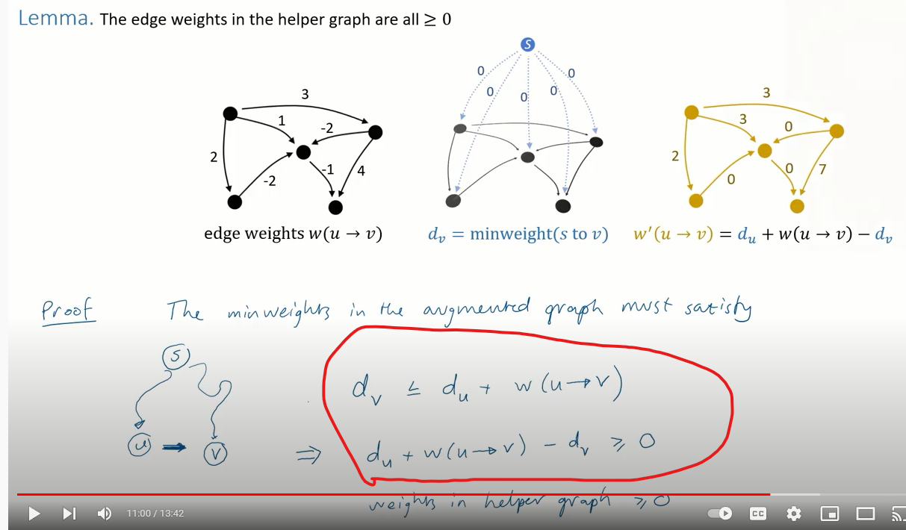
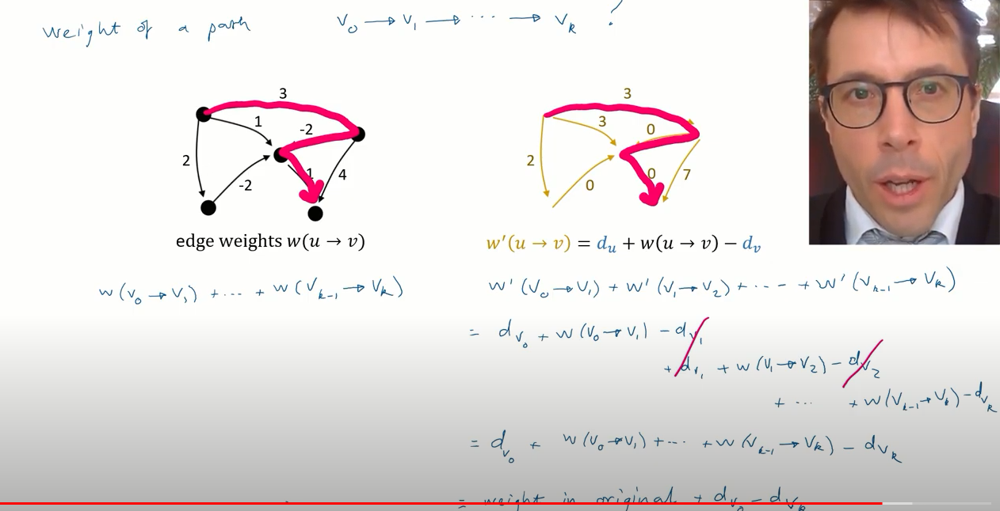

https://www.youtube.com/watch?v=qDDat59ylv4
Proof of why the adjusted weights are positive.
u->v is original weight
S is the temporary starting vertex created
s->u is the shortest distance between s and u
s->v is the shortest distance between s and v
s-v <= s-u + u-v (minimum path s->v must be as good or better than a path from s-u + u-v )
simplifying above
(- s-v) + s-u + uv >= 0 

Proof that the adjusted weights (weights made non negative) amount to :
dv0 + u->v1 -dv1 + dv1 + v1v2 +.....v(n-1)vn - dvn
intermediate adjustments cancel out (-dv1 + dv1). 
hence calculated shortest path weight between two nodes 
A->B = dA + A->B  -dB .
Hence to get the shortest path between any two vertices you just adjust the calculated
paths by +dB -dA
